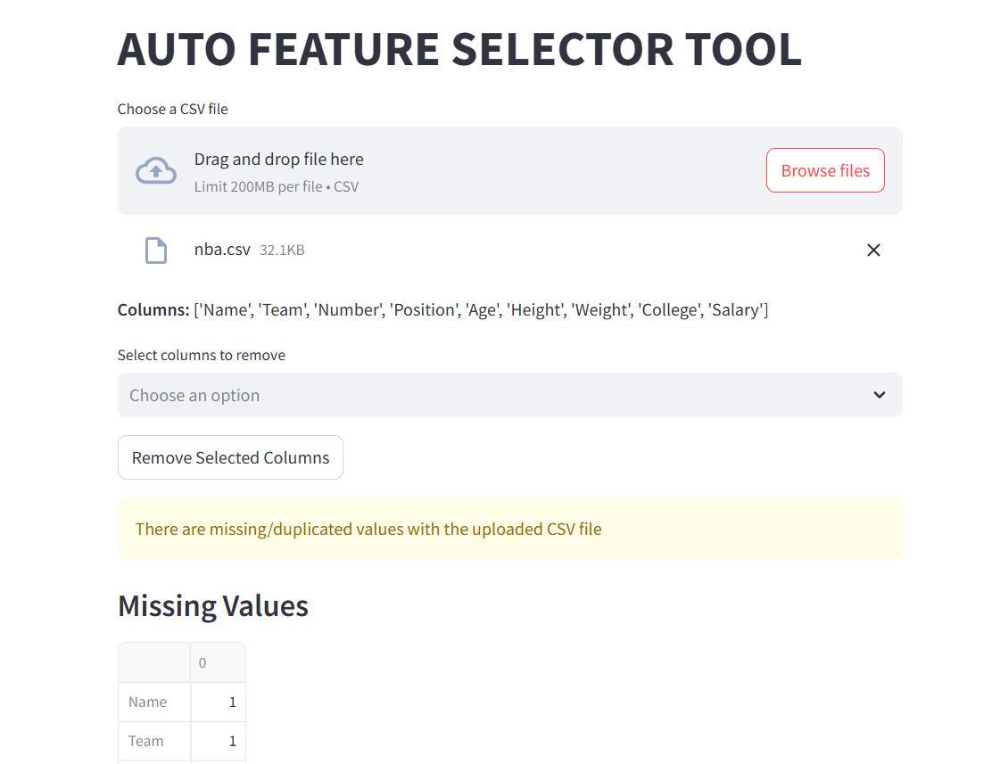

# Auto Feature Selector Tool

## Overview
The Auto Feature Selector Tool is a powerful, web-based application built with Streamlit to streamline the feature selection process in machine learning workflows.

It empowers data scientists and analysts to automatically identify the most relevant features for their models through an intuitive interface, without manual coding.

The tool supports a variety of statistical methods such as Correlation Coefficient, Chi-Square Test, ANOVA, Mutual Information, and Variance Threshold, along with automatic transformation of categorical data.

# Watch the demo of the project at:
[](https://youtu.be/BVdRvofCRZA)

## 🗂️ Table of Contents
- [Project Setup](#setup)
- [Features](#features)
- [Usage](#usage)
- [File Upload](#file-upload)
- [Feature Selection Methods](#feature-selection-methods)


---


## Setup <a name="setup"></a>
### 1. Clone the Repository
```
git clone https://github.com/sameeratanveer/auto-feature-selector-tool.git
cd auto-feature-selector-tool
```
### 2. Install Dependencies <a name="dependencies"></a>
Ensure you have Python 3.x installed. Then, set up a virtual environment and install the required packages:
```
python3 -m venv env
# Activate virtual environment:
# macOS/Linux
source env/bin/activate
# Windows
env\Scripts\activate

pip install -r requirements.txt

```

## Features <a name="features"></a>
📂 CSV File Upload: Upload datasets directly from your local system.

🛠️ Automatic Object Column Transformation: Converts categorical (object) columns into numerical format using label encoding or one-hot encoding.

🔍 Feature Selection Methods:

Correlation Coefficient

Chi-Square Test

ANOVA (Analysis of Variance)

Mutual Information

Variance Threshold Filtering

📊 Visual Feedback: View selected features and transformed datasets instantly.

🖥️ Streamlit Web App: Lightweight, user-friendly interface.

## Usage <a name="usage"></a>
Start the Application
Run the Streamlit app locally using:
```
streamlit run app.py
```
The app will automatically open in your default web browser.

## Main Workflow
Upload Dataset:
Upload your .csv file via the file uploader.

Transform Object Columns:
Click the "Transform Object Columns" button to encode categorical features.

Select Target Column:
Choose the target variable (the feature you wish to predict).

Apply Feature Selection:
Select and run one or more of the available feature selection methods.

Download or Use:
View or download the transformed dataset with selected features.

### 📂 File Upload <a name="file-upload"></a>
Accepts files in CSV format.

Displays a preview of the uploaded dataset.

Supports large datasets efficiently.

### 🔍 Feature Selection Methods <a name="feature-selection-methods"></a>
1. Correlation Coefficient
Measures the strength and direction of linear relationships between features and the target variable.

Retains features with high correlation.

2. Chi-Square Test
Used for categorical variables to test their independence from the target variable.

Selects statistically significant features.

3. ANOVA (Analysis of Variance)
Compares mean differences between multiple groups.

Selects features whose variation between groups is significant.

4. Mutual Information
Measures the amount of information one feature shares with the target.

Selects features with high information gain.

5. Variance Threshold
Removes features with very low variance (constant or near-constant values).

Simplifies models and reduces overfitting.
